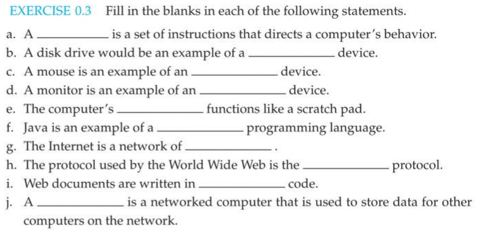

# Chapter 0 - Prework Assignment

## Exercise 0.3

  - a. program
  - b. output
  - c. input
  - d. output
  - e. main memory (RAM)
  - f. high-level
  - g. networks
  - h. HyperText Transfer
  - i. HTML
  - j. server