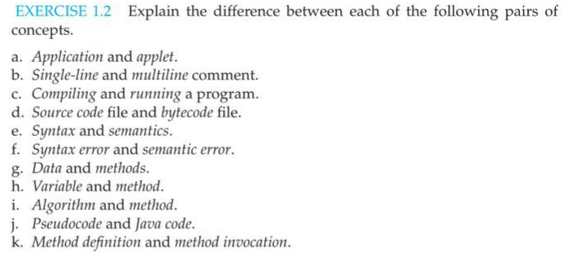
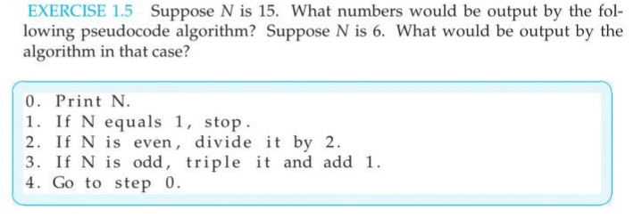

# Module 8

## Exercise 0.3

  - a. program
  - b. output
  - c. input
  - d. output
  - e. main memory (RAM)
  - f. high-level
  - g. networks
  - h. HyperText Transfer
  - i. HTML
  - j. server

## Exercise 1.2

  - a. The application is a program that is executed in the terminal where as an applet is executed in the web page.
  - b. Using 
  // for single line comment that will not exeed the one line 
  vs 
  /* */ that may span several line but no code will be execute anything within this syntax
  - c. Compiling would be checking that all syntax was followed and making one entire code block without spaces. Running would be executing the code block to obtain the code's outcome/result.
  - d. Source code file is the raw code that has not yet been compiled and can be edited. Bytecode file is the compiled code that Java can understand and execute.
  - e. Syntax are the set of rules that govern formatting code and semantics is the meaning or outcome of a statement
  - f. Syntax error is forgetting/breaking rules involved in writing code such as ending a line with a semicolon. Semantic error would be getting the wrong outcome from written lines of code. 
  - g. Data is the information that will be inputed/outputed. The method is a set of operation(s) that can be performed on a given data type; they correspond to an object's behavior/actions.
  - h. Variable is a place holder for data that belongs to an object. The method is the operation(s) that can be performed on the variable based on its data type.
  - i. Algorigthm is a step-by-step description of the process of a solution to a problem. Method can use several algorithms to solve individual problems/step
  - j. Psedocode: a hybrid language of English and code that helps draft steps of code. Java code: code that follows syntax and semantics in order to execute and acheived an outcome/result.
  - k. Method definition: defining/declaring what the method will do or what actions it will take. Method invocation: using the method to get an output/result.

## Exercise 1.5

  - a. If N = 15, the numbers printed would be 15, 46, 70, 35, 106, 53, 160, 80, 40, 20, 10, 5, 16, 8, 4, 2, 1
  - b. If N = 6, output should be 6, 3, 10, 5, 16, 8, 4, 2, 1
  
